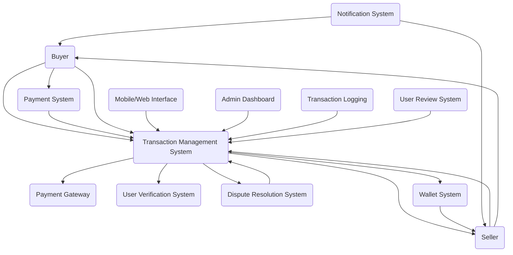

```mermaid
flowchart TD
    A1(Buyer)
    B1(Transaction Management System)
    C1(Seller)
    D(Payment System)
    E(Payment Gateway)
    F(User Verification System)
    G(Dispute Resolution System)
    W(Wallet System)
    M(Mobile/Web Interface)
    N(Admin Dashboard)
    T(Transaction Logging)
    P(Notification System)
    R(User Review System)

    A1 --> B1
    C1 --> B1
    A1 --> D
    D --> B1
    B1 --> C1
    C1 --> A1

    B1 --> E
    B1 --> F
    B1 --> G

    A1 --> B1
    B1 --> W
    W --> C1

    M --> B1
    N --> B1

    T --> B1

    P --> A1
    P --> C1

    R --> B1

    G --> B1
```
